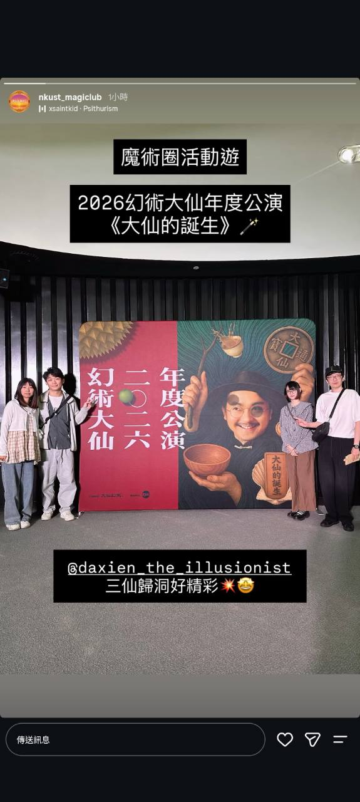

# 認識我們
## ABOUT NKUST MAGIC CLUB

---

## 社團宗旨

本社團希望「以互相幫助、奉獻」為理念，把魔術正確的理論概念、魔術重要的表演術及對魔術的熱忱等傳授給社員，鼓勵社員積極參與各式魔術表演大會、研習會及魔術比賽，共創更多歷史與佳績。

---

## 社團簡介

魔術廣泛的定義為各種以專業技巧或知識展示出讓人覺得歡笑、不可思議的藝術表演，併校後本社團秉持正確魔術理念及比賽獲獎紀錄，逐漸成為南部最具影響力之魔術社團。

2005年成立至今，造就許多比賽得獎及受邀擔任嘉賓的社員，本社舉辦的大型活動也邀請過國際嘉賓（日本、香港、馬來西亞、韓國）蒞臨。

---

## 六大魔術體驗

### 魔術社課

- [觀看魔術社課貼文](https://www.instagram.com/p/DYQqXmCk5BO)

### 期初茶會

- [觀看期初茶會貼文](https://www.instagram.com/p/DVgDcDokdmF)

### 街頭魔術行動

- [觀看街頭魔術行動貼文](https://www.instagram.com/p/DROTPrUkduB)

### 大型魔術晚會

- [觀看大型魔術晚會貼文](https://www.instagram.com/tv/CkS6QW0tYpQ)

### 跨校魔術交流

- [觀看跨校魔術交流貼文](https://www.instagram.com/p/DYa5IBzk8mm)

### 魔術圈活動遊

