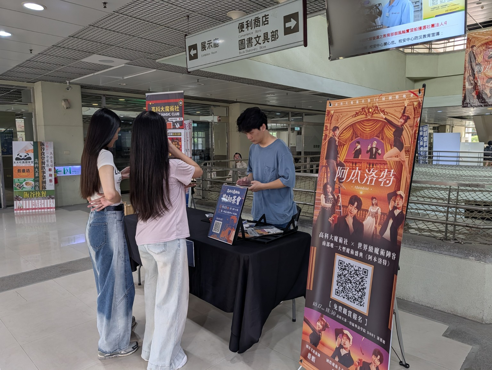
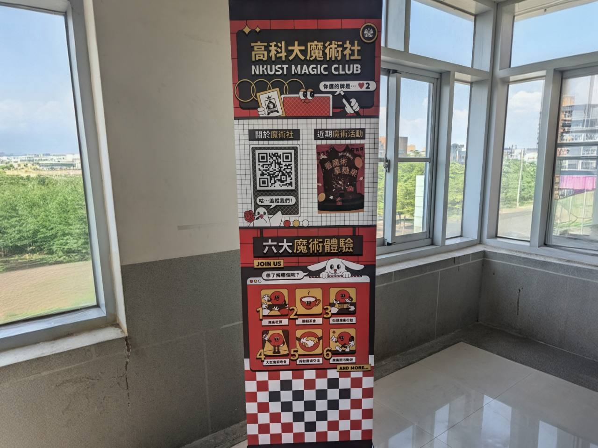
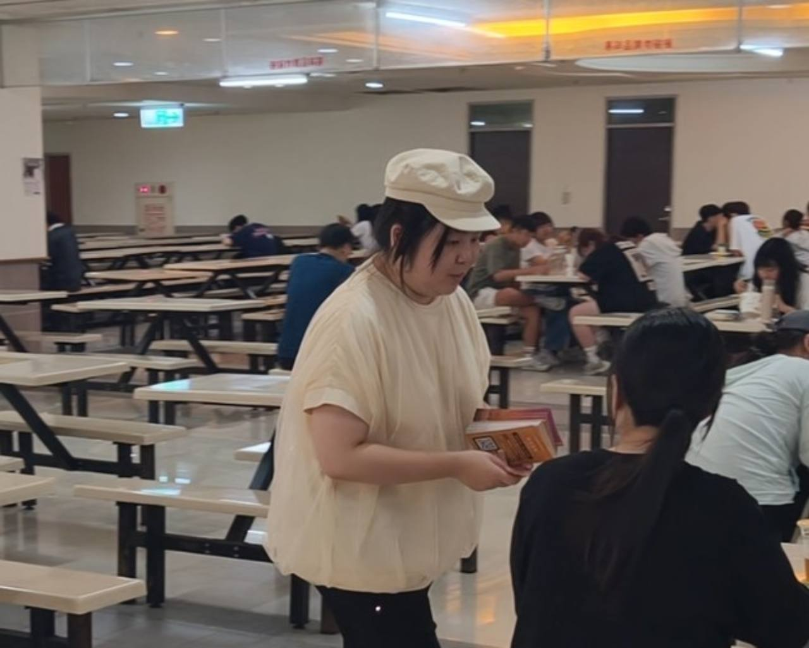
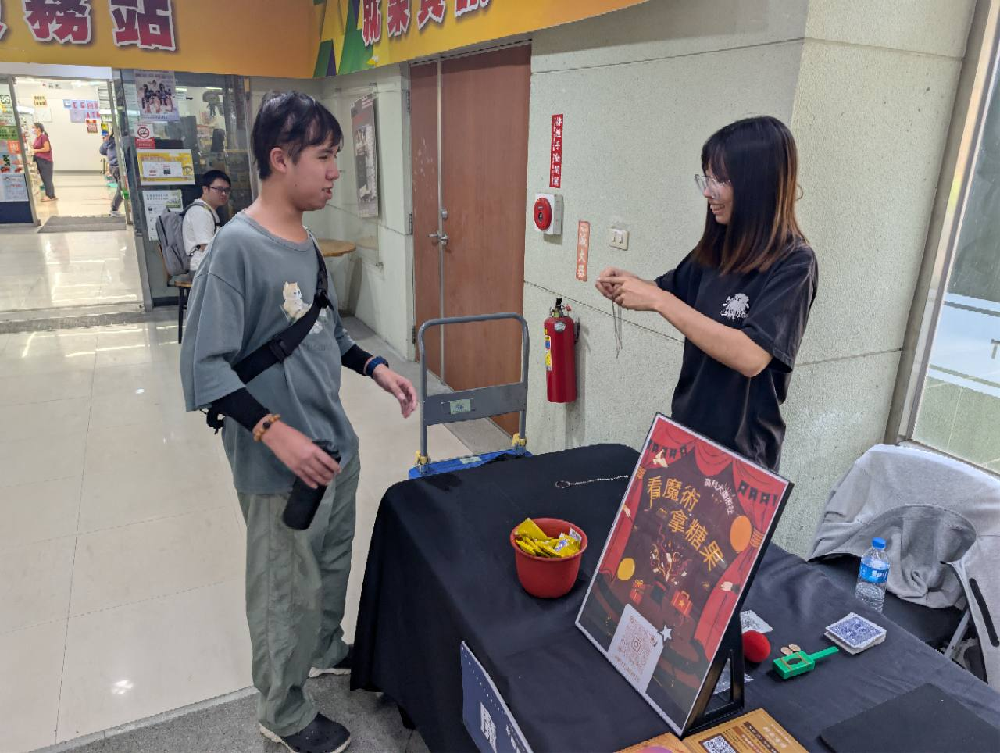
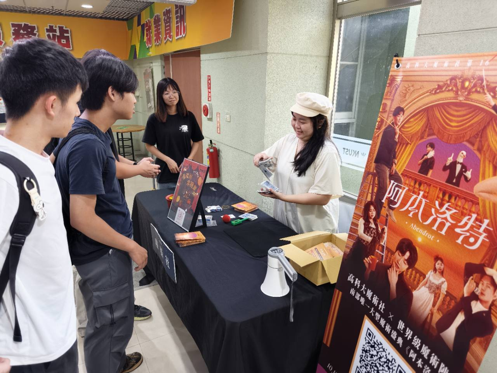

<!--
街魔行動頁面的文字、照片與 Instagram 貼文都放在這裡。
圖片先放進 images/，格式：
同一區加入多張圖片時會自動變成輪播，圖片說明會顯示成小字。
Instagram 貼文使用：- [貼文名稱](完整網址)
-->

# 街頭魔術
## 09/17（四）、09/18（五）延長登場・打卡送飲料

---

## 街魔行動延長

09/09（三）至 09/16（三）的街魔行動延長到 09/17（四）、09/18（五）！來看近距離魔術，拍照打卡再送手搖飲。

時間：09/17（四）、09/18（五）12:20–12:50。

地點：第一校區活動中心一樓・街頭魔術攤位。

---

## 打卡送飲料

在第一校區活動中心，與《阿本洛特》大掛布或 X 型展架拍照打卡，並標記 Instagram @nkust_magiclub。

到街頭魔術攤位出示打卡畫面，由現場工作人員確認後即可兌換手搖飲。兌換對象限本校在校生與教職員，飲料品項依現場提供。

09/22（二）17:00–21:00，也可以到第一校區社團嘉年華的 27 號魔術社攤位打卡兌換。

- [前往魔術社 Instagram](https://www.instagram.com/nkust_magiclub/)
- [查看 09/22 社團嘉年華活動](club-fair.html)

---

## 街頭魔術

街頭魔術是走進日常場域、與觀眾近距離互動的魔術表演。它不需要正式舞台，魔術師會直接在觀眾眼前創造不可思議的瞬間，也讓每一次反應成為演出的一部分。

09/09（三）至 09/16（三），高科大魔術社把奇蹟帶到校園各處，邀請大家停下腳步，近距離感受魔術。

---

## 現場紀錄

---

## Instagram 街魔紀錄

- [街頭魔術紀錄（一）](https://www.instagram.com/reel/DRduPDLEVk-)
- [街頭魔術紀錄（二）](https://www.instagram.com/p/DS2bn1rkUZc)
