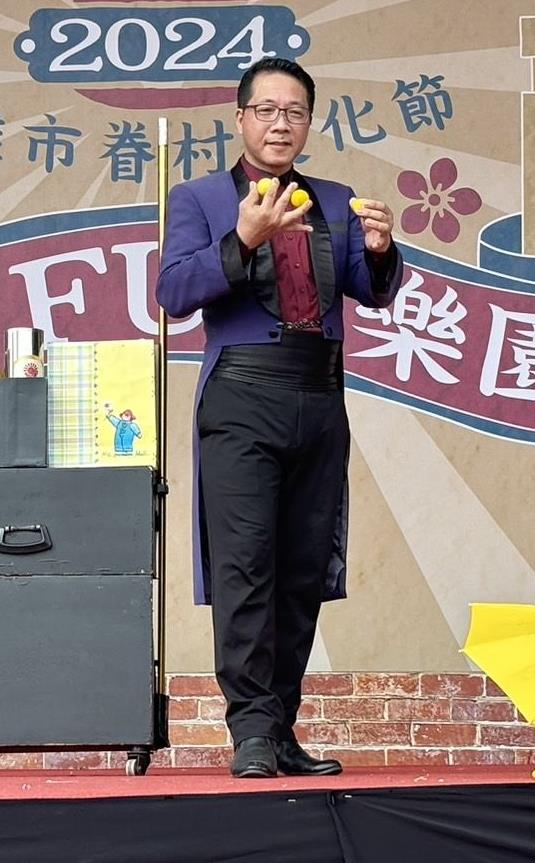

# 指導老師與幹部
## 高科大魔術社

---

## 指導老師｜陳炳榮

職業魔術師、高雄市魔術協會前理事長，長期投入魔術表演、校園教學與魔術推廣，具國立高雄科技大學、屏東教育大學、空軍官校、高雄高工、五福國中等校魔術社團指導經驗。

曾參與推動「二分鐘舞臺魔術交流賽」，為魔術新手提供上臺演出、累積經驗與交流學習的機會，也曾將魔術表演結合校園反毒宣導，讓魔術走進不同的學習與生活場景。

---

## 社長｜盧敬勳

機電工程系

---

## 副社長｜許力勻

資訊管理系

