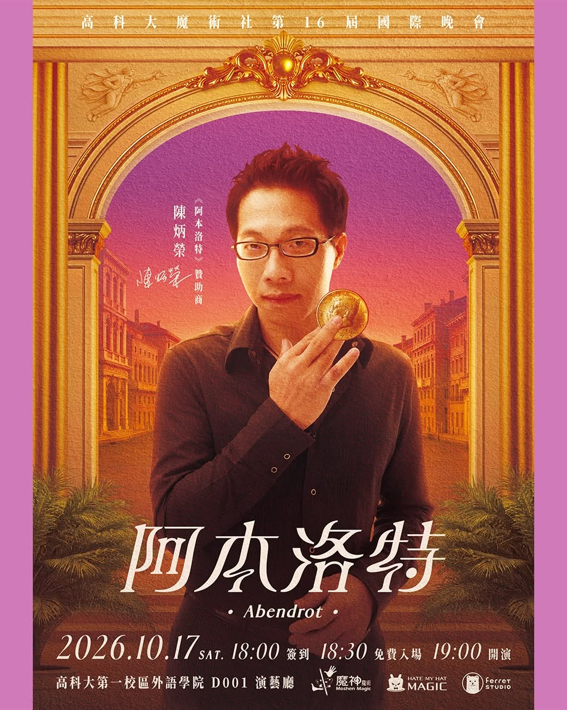
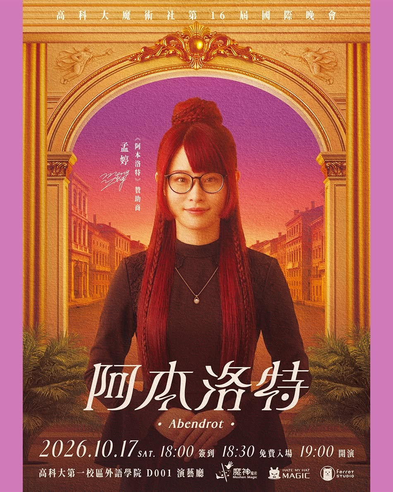
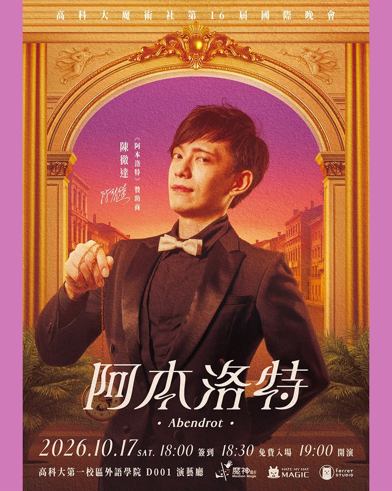
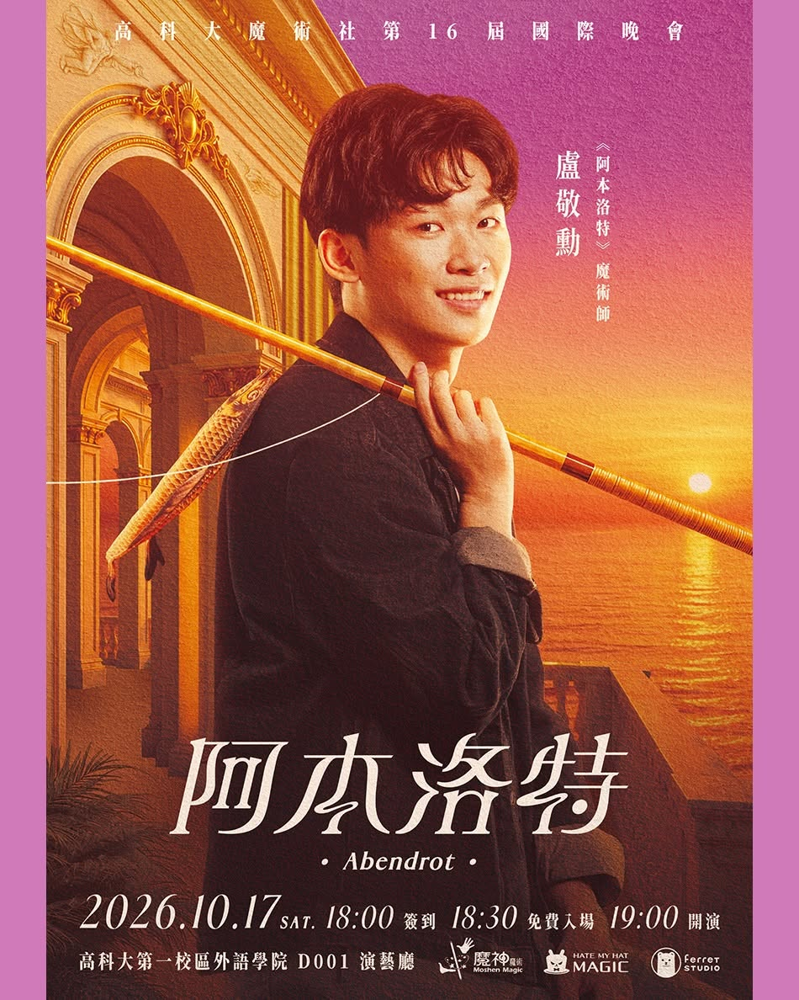
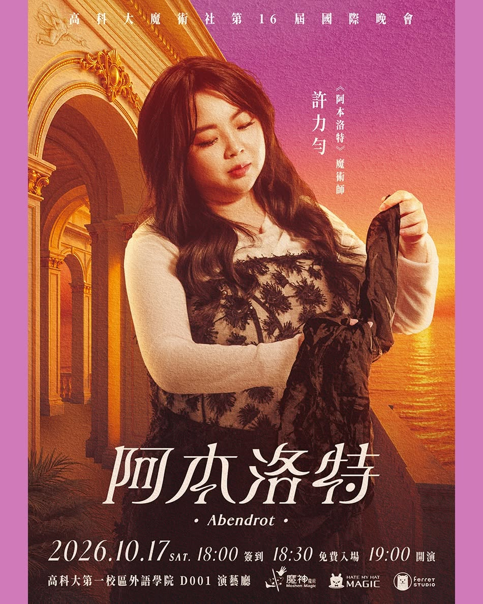

# 指導老師與幹部
## 高科大魔術社

---

## 指導老師｜陳炳榮

職業魔術師、高雄市魔術協會前理事長，長期投入魔術表演、校園教學與魔術推廣，具國立高雄科技大學、屏東教育大學、空軍官校、高雄高工、五福國中等校魔術社團指導經驗。

曾參與推動「二分鐘舞臺魔術交流賽」，為魔術新手提供上臺演出、累積經驗與交流學習的機會，也曾將魔術表演結合校園反毒宣導，讓魔術走進不同的學習與生活場景。

---

## 行政顧問｜孟婷（MT Yang）

Ferret Studio 平面設計創作者，作品涵蓋魔術表演海報、活動主視覺、書籍與撲克牌設計。長期參與高科大魔術社視覺設計與活動企劃，擔任第 8–16 屆成果發表晚會主視覺設計師，並參與由高科大魔術社主辦的 RE-ACT 系列活動企劃。

曾擔任《魔術師的魔術》系列書籍封面設計與下冊插圖繪製，並參與韓國 Lukas《A Trip To The Moon》海報、OMG 魔術大會《金牌魔術腦》主視覺及賴柏承《FANtast》撲克牌設計。

---

## 魔術顧問｜陳徹達

「搞怪魔術帽」創辦人，長期投入魔術教學、表演與出版，曾獲 2022《TMA × 獨角獸》超新星選拔賽第二名。曾任高科大魔術社指導老師，並參與社團成果展，以及由高科大魔術社主辦的《RE-ACT 魔術交流會》與《RE-ACT SHOW》等活動籌辦。

出版《魔術師的魔術》系列書籍，並為下冊《魔術師的魔術：談魔術實作》撰寫註解；系列著作由國際知名魔術師劉謙撰寫序文並推薦。

---

## 社長｜盧敬勳

機電工程系

---

## 副社長｜許力勻

資訊管理系

